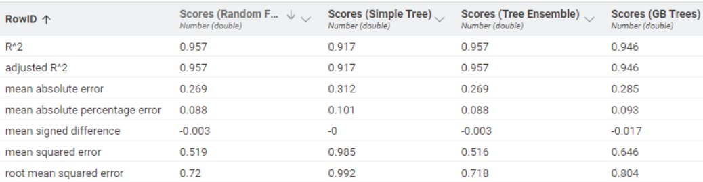

# Data Science Project for TKL Logistics

## Project Overview

This project analyzes historical logistics data provided by TKL Logistics to predict key metrics like CO₂ emissions, transport duration, delivery duration, and total transport cost. The workflow involves data correction, preprocessing, model training, and evaluation to determine the best predictive models for each target.

Workflow Summary

1. Data Correction

    Used `date_corrector.py` (Python script) to:
        Ensure _DeliveryDate > UnloadingDate > LoadingDate_.
        Correct year discrepancies (e.g., 2204 → 2024).

    Used `distance_corrector.py` (Python script) to:
        Get distances categorised by *FromISO*, *ToISO* and *MeansOfTransport*(optional)
        Get mean distance of each category
        Corrected empty distances using the means from each category

    Used `data_corrector.py` (Python script) to:
        Call Necessary functions from `date_corrector.py` and `distance_corrector.py` to clean dates and distances and drop all entries that still have invlid dates and distances.

2. Loading and Conversion

    Loaded corrected JSON data into KNIME using:
        **JSON Reader**: Load the JSON file.
        **JSONPath**: Convert the JSON structure into a table format.

3. Data Preprocessing

Performed various preprocessing steps to clean and prepare data:

  **String Manipulation**: Correct formatting issues.
  **String to Date&Time**: Parse dates into the correct format.
  **Date&Time Difference**: Calculate durations between dates.
  **Column Filter**: Remove unnecessary columns.
  **String to Number**: Convert categorical data to numeric.
  **Missing Value**: Handle missing entries.
  **Rule Engine**: Create custom rules for data consistency.
  **Category to Number**: Encode categorical variables.
  **Numeric Outliers**: Handle outliers.
  **Normalizer**: Scale data for consistent modeling.

4. Model Training

## Split data into four parts for the following predictors:

  - CO₂ Emissions
  - Transport Duration
  - Delivery Duration
  - Total Transport Cost

## Trained and evaluated three regression models for each target:

  - Simple Regression Tree
  - Tree Ensemble for Regression
  - Gradient Boosted Trees for Regression

5. Model Evaluation

    Used 10-fold cross-validation to evaluate model performance.
    Compared models using the Numeric Scorer node for metrics like R², MAE, and RMSE.
    Combined results using the Column Appender for final comparison.

## Results

  Identified the best-performing models for each predictor.
  Visualized and analyzed results to provide actionable insights for TKL Logistics.

  Results for CO2 Prediction models

  Results for Transport Duration Prediction models

  Results for Delivery Duration Prediction models

  Results for Transportation Cost Prediction models

  The best model for each parameters turns out to be Random Forest.

## How to Run

  Run `data_corrector.py` to preprocess the raw JSON file.
  Load the corrected JSON file into KNIME.
  Execute the KNIME workflow to preprocess data, train models, and evaluate results.

## Dependencies

  Python (for data_corrector.py).
  KNIME Analytics Platform.
  Historical logistics data provided by TKL Logistics.

## Future Enhancements

  Incorporate more advanced models for predictions.
  Explore hyperparameter tuning for model optimization.
  Integrate real-time data processing for better predictions.
